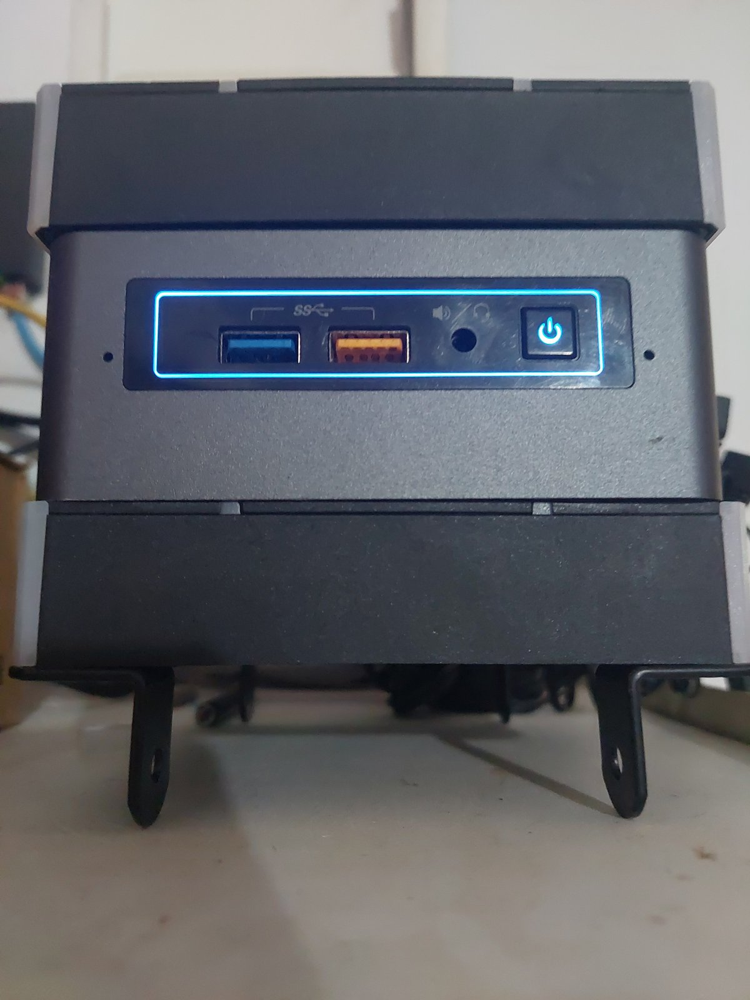
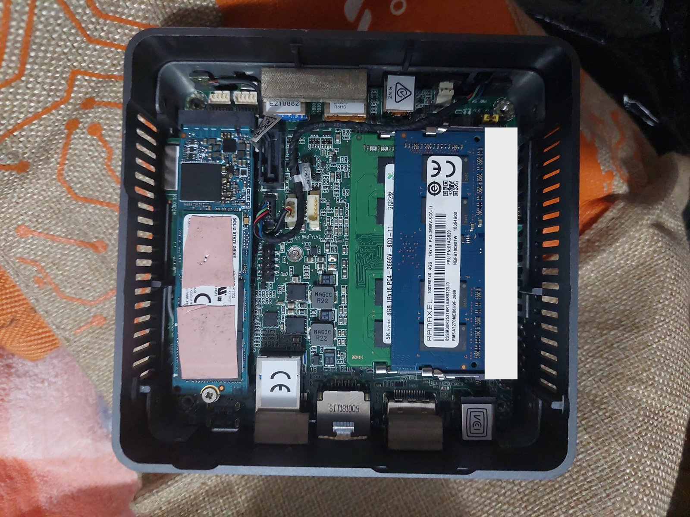
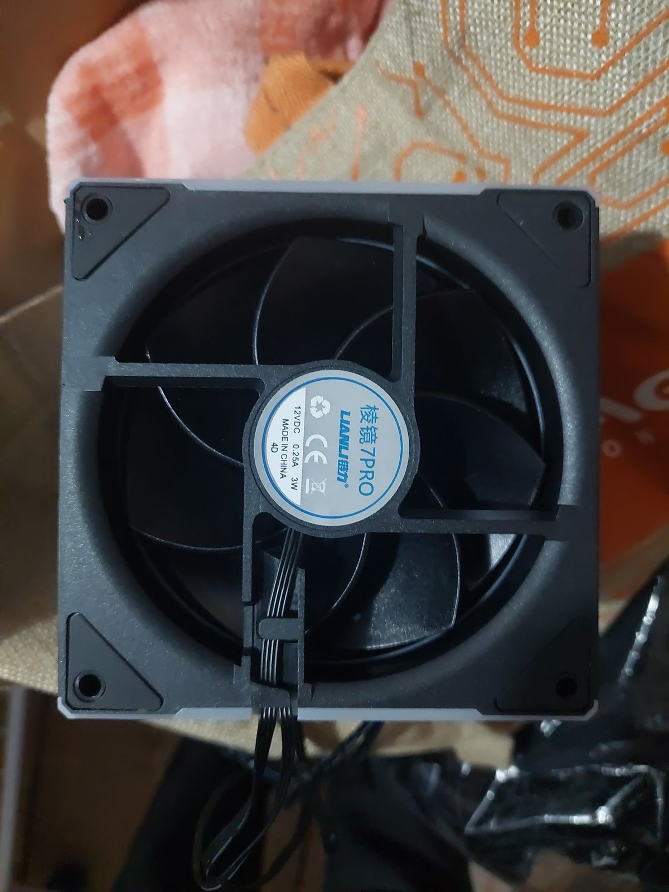

# Intel NUC7i7BNH Hackintosh: macOS Sequoia (OpenCore 1.0.6)

A complete, tested build record for running **macOS Sequoia 15.7** on an **Intel NUC7i7BNH** (Baby Canyon), used as a quiet, always-on home server and workstation.

> **Based on [shuai620/NUC7i7BNH](https://github.com/shuai620/NUC7i7BNH).** The EFI here is shuai620's [`OC_1.0.6_sequoia`](https://github.com/shuai620/NUC7i7BNH/tree/master/OC_1.0.6_sequoia) with a few documented changes. All credit for the base EFI goes to shuai620. See [Credits](#credits) for every kext and tool used.

| | |
|---|---|
| Status | ✅ **Stable.** 4 benchmark runs: no panics, no thermal throttling, 3.9 GHz on all threads. [Details →](BENCHMARK.md) |
| macOS | Sequoia 15.7.7 (24G720), **SIP enabled**, no root patches |
| Bootloader | OpenCore 1.0.6 (REL-106-2025-11-03) |
| SMBIOS | Macmini8,1 |
| Temperatures | No external fans: idle 47 °C, full load ≤ 84 °C · With 2 external 120 mm fans: idle 39 °C, full load ≤ 78 °C |
| Last updated | 2026-09-25 |

<p align="center"></p>

## Contents
- [Specs](#specs)
- [Photos](#photos)
- [EFI](#efi): source and every change from upstream
- [BIOS settings](#bios-settings)
- [macOS tuning](#macos-tuning)
- [Benchmark summary](#benchmark-summary) ([full report](BENCHMARK.md))
- [Security](#security)
- [What works / what doesn't](#what-works--what-doesnt)
- [Rescue and recovery](#rescue-and-recovery)
- [Credits](#credits)
- [Project history and lessons learned](HISTORY.md)
- Folders: [`efi/`](efi/) (sanitized config), [`tools/`](tools/) (benchmark tools), [`benchmark/`](benchmark/) (raw data), [`photos/`](photos/)

---

## Specs

| Part | Detail |
|---|---|
| Model | Intel NUC7i7BNH (NUC7i7BNB board, "Baby Canyon"), BIOS 0093 or later |
| CPU | Intel Core i7-7567U (Kaby Lake), 2 cores / 4 threads, 3.5 GHz base / 4.0 GHz turbo, 4 MB cache, 28 W TDP |
| GPU | Intel Iris Plus Graphics 650 (0x5927), 64 MB eDRAM, 1.5 GB shared, **Metal 3** |
| RAM | 8 GB: 1 × SK hynix 4 GB + 1 × Ramaxel 4 GB, DDR4 SO-DIMM PC4-2666 (1Rx16), running at 2133 MHz (the CPU's limit). Up to 32 GB supported |
| Storage | Toshiba XG6 1 TB NVMe M.2 (KXG6AZNV1T02); 2.5" SATA bay free |
| Ethernet | Intel I219-V, 1 Gbps |
| Wi-Fi / Bluetooth | Intel Wireless-AC 8265 (Wi-Fi 5, BT 4.2) |
| Audio | Realtek ALC283, plus HDMI audio |
| Thunderbolt | Thunderbolt 3 / USB-C (JHL6340) |
| Ports | 4 × USB 3.0, 1 × USB-C/TB3, HDMI 2.0a, microSD reader |
| Cooling | Stock blower; thermal paste replaced |
| External cooling (optional) | 2 × 120 mm fans (label: *LIANLI 棱镜 7PRO*, 12 V DC, 0.25 A, 3 W, 4-pin), mounted on the open top and bottom with cable ties and brackets, powered from a 12 V SATA port at 100%. Bottom blows in, top blows out (see [BENCHMARK.md](BENCHMARK.md)) |
| Display | Runs headless with an **HDMI dummy plug** (for Screen Sharing) |
| Installer / rescue USB | ADATA 32 GB USB 3.2 flash drive (Sequoia 15.8 installer + OpenCore) |

## Photos
| Front, with external fans | Inside (bottom plate off) | External fan |
|---|---|---|
|  |  |  |
| Stock NUC7i7BNH with a 120 mm fan clamped on the top and bottom. The front USB, audio and power button stay accessible | Toshiba XG6 1 TB NVMe (left), 2 × 4 GB DDR4 SO-DIMM (right), and the free SATA connector for a 2.5" drive (centre). Board label blurred | 12 V DC, 0.25 A, 3 W, 4-pin; powered from 12 V SATA |

## EFI

**Upstream:** [shuai620/NUC7i7BNH, `OC_1.0.6_sequoia`](https://github.com/shuai620/NUC7i7BNH/tree/master/OC_1.0.6_sequoia) (OpenCore 1.0.6, Macmini8,1).

### Changes from upstream

| # | Area | Change | Reason |
|---|---|---|---|
| 1 | PlatformInfo | New unique serial, MLB, SystemUUID and ROM (made with `macserial` from the official OpenCore 1.0.6 release) | The upstream config contains the author's own serial. Shared serials break iCloud, iMessage and FaceTime |
| 2 | NVRAM → Delete | Added `prev-lang:kbd` | The installer showed Russian because of an old NVRAM value |
| 3 | Kernel → Add | Added **itlwm.kext v2.3.0** (after IntelMausi) | Wi-Fi for the Intel 8265, used with the HeliPort app. No root patches or SIP changes needed |
| 4 | boot-args | Removed `-v` | Quiet boot |
| 5 | Misc → Boot | `ShowPicker=false`, `Timeout=0`, `PollAppleHotKeys=true` | Boots straight to macOS. Hold **Option/Esc** for the picker |
| 6 | Misc → Debug | `Target 19 → 0` | No on-screen or file logging from OpenCore |
| 7 | Kernel → Add | Disabled **Sinetek-rtsx**, **CodecCommander**, **HibernationFixup** | SD reader unused, and a known source of hangs. Sleep and hibernate are disabled, so the other two aren't needed |

The resulting boot-args are:
```
keepsyms=1 slide=0 darkwake=0 -cdfon lilucpu=9 igfxonln=1 amfi_get_out_of_my_way=1
```

### Kexts

| Kext | Enabled | Purpose |
|---|---|---|
| Lilu | ✅ | Patch engine |
| AMFIPass | ✅ | AMFI helper |
| VirtualSMC, SMCProcessor, SMCSuperIO | ✅ | SMC emulation and sensors |
| WhateverGreen | ✅ | iGPU (Iris Plus 650) |
| FakePCIID | ✅ | HDMI audio |
| CPUFriend + CPUFriendDataProvider | ✅ | CPU power management data |
| AppleALC | ✅ | Audio, ALC283 |
| IntelMausi | ✅ | Ethernet |
| **itlwm** | ✅ | Wi-Fi, with HeliPort |
| BlueToolFixup, IntelBTPatcher, IntelBluetoothFirmware | ✅ | Bluetooth |
| USBMap | ✅ | USB port map (Macmini8,1, AppleUSBXHCISPTLP) |
| NVMeFix | ✅ | NVMe power management |
| CodecCommander | ❌ | Not needed, since sleep is off |
| Sinetek-rtsx | ❌ | SD reader unused |
| HibernationFixup | ❌ | Not needed, since hibernation is off |

The upstream folder also contains AirportItlwm, IO80211FamilyLegacy and IOSkywalkFamily. They are used only by the author's `config-patch.plist`, the native Wi-Fi setup that needs an OCLP root patch. They aren't used here.

### Config backups on the SSD's EFI (`EFI/OC/`)

| File | State |
|---|---|
| `config-before-wifi.plist` | Before itlwm was added |
| `config-before-quiet.plist` | Before verbose and the picker were turned off |
| `config-before-driver-trim.plist` | Before the 3 kexts were turned off |
| `config.plist` | **Current** |
| `config-patch.plist` | Upstream native Wi-Fi variant (AirportItlwm + OCLP), not used |

> ⚠️ **Never publish your real `config.plist`.** Its `PlatformInfo` section contains the machine's unique serial numbers. See [`efi/README.md`](efi/README.md).

## BIOS settings
Enter the BIOS with the **power button menu**: with the NUC off, hold the power button for **3 seconds** and let go before 4 → **F2** for setup, **F10** for the boot menu. This works even when Fast Boot hides the normal prompt.

| Setting | Value | Status |
|---|---|---|
| Boot → Secure Boot | Disabled | Required |
| Boot → UEFI Boot | Enabled; Legacy Boot disabled | Required |
| Boot → **Fast Boot** | **Disabled** | Recommended. It skipped USB and blocked F2 |
| Boot → Boot Priority | Internal SSD (OpenCore) first | Required |
| Security → Intel VT-d | Disabled (the config also has `DisableIoMapper`) | Either |
| Devices → Thunderbolt security | Legacy / no security | Recommended |
| Power → Deep S4/S5 | Disabled | Needed for Wake on LAN |
| Power → Wake on LAN from S4/S5 | Power On – Normal Boot | Wake on LAN |
| Power → After Power Failure | Power On (optional) | Needed for the "smart plug" remote power-on idea |
| Performance → Package Power Limit 1 / 2 | **Keep the defaults (28 W)**. Optionally raise PL1 to about 30 W for mixed CPU+GPU work | See [BENCHMARK.md](BENCHMARK.md). Lowering PL1 cuts sustained speed |
| Cooling → Fan Control Mode | Balanced or Cool | Optional |

## macOS tuning
All of these were applied over SSH and can be reverted.

### Power (`pmset`)
Sleep does **not** work on this Hackintosh, so every form of sleep is off to avoid hangs. The previous values are saved on the NUC in `~/pmset-before-2026-09-25.txt`.
```bash
sudo pmset -a sleep 0 disksleep 0 standby 0 autopoweroff 0 powernap 0 \
  proximitywake 0 hibernatemode 0 displaysleep 10 womp 1 autorestart 1
```

### Updates, Siri and analytics
```bash
SU=/Library/Preferences/com.apple.SoftwareUpdate
sudo defaults write $SU AutomaticDownload -bool false
sudo defaults write $SU AutomaticallyInstallMacOSUpdates -bool false
sudo defaults write $SU CriticalUpdateInstall -bool true      # keep security responses
sudo defaults write $SU AutomaticCheckEnabled -bool true
defaults write com.apple.assistant.support "Assistant Enabled" -bool false
defaults write com.apple.Siri StatusMenuVisible -bool false
defaults write com.apple.Siri UserHasDeclinedEnable -bool true
defaults write com.apple.Siri VoiceTriggerUserEnabled -bool false
D="/Library/Application Support/CrashReporter/DiagnosticMessagesHistory.plist"
sudo defaults write "$D" AutoSubmit -bool false
sudo defaults write "$D" ThirdPartyDataSubmit -bool false
defaults write com.apple.assistant.support "Siri Data Sharing Opt-In Status" -int 2
```

### Animations off (for remote use)
```bash
G=NSGlobalDomain
defaults write $G NSAutomaticWindowAnimationsEnabled -bool false
defaults write $G NSWindowResizeTime -float 0.001
defaults write $G NSScrollAnimationEnabled -bool false
defaults write $G NSUseAnimatedFocusRing -bool false
defaults write $G NSToolbarFullScreenAnimationDuration -float 0
defaults write $G NSBrowserColumnAnimationSpeedMultiplier -float 0
defaults write $G NSDocumentRevisionsWindowTransformAnimation -bool false
defaults write $G QLPanelAnimationDuration -float 0
defaults write com.apple.finder DisableAllAnimations -bool true
defaults write com.apple.dock launchanim -bool false
defaults write com.apple.dock mineffect -string scale
defaults write com.apple.dock expose-animation-duration -float 0
defaults write com.apple.dock autohide-delay -float 0
defaults write com.apple.dock autohide-time-modifier -float 0
defaults write com.apple.dock springboard-show-duration -float 0
defaults write com.apple.dock springboard-hide-duration -float 0
defaults write com.apple.dock springboard-page-duration -float 0
defaults write com.apple.dock workspaces-swoosh-animation-off -bool true
defaults write com.apple.Mail DisableReplyAnimations -bool true
defaults write com.apple.Mail DisableSendAnimations -bool true
defaults write com.apple.universalaccess reduceMotion -bool true
defaults write com.apple.universalaccess reduceTransparency -bool true
killall Dock Finder SystemUIServer
```

### Stuck `rpcsvchost` (netlogon), fixed
With File Sharing (SMB) on, `/usr/libexec/rpcsvchost -launchd netlogon.bundle` sat at **100% CPU** after every boot. The CPU idled at about 61–77 °C and 11 W instead of about 42 °C and 2 W. The service is for Windows domain (Active Directory) logins, which this NUC doesn't use, so it's disabled:
```bash
sudo launchctl disable system/com.apple.msrpc.netlogon
sudo launchctl bootout system/com.apple.msrpc.netlogon
# undo: sudo launchctl enable system/com.apple.msrpc.netlogon
```
SMB file sharing with local accounts still works without it.

### Background audit (2026-09-25)
- No third-party LaunchAgents, LaunchDaemons or login items. HeliPort is the only non-Apple process.
- Built-in Apple apps live on the sealed system volume and **must not be removed**, because removing them breaks SIP and updates. Their helpers are idle, about 500 MB RAM in total.
- Optional GUI clean-up: remove the Stocks, Weather and Calendar widgets, turn off Siri suggestions in Spotlight, and turn off Location Services if it isn't needed.

## Benchmark summary
A staged stress test (idle → 1 thread → 2 threads → 4 threads → CPU + GPU + memory → recovery) was run **after the BIOS and macOS tuning above**, in 4 cooling setups. [Full per-stage details →](BENCHMARK.md)

**CPU temperature, average / peak (°C)**

| Stage | CPU usage | Run 1: **no external fans** | Run 2: fans, top blowing in | Run 3: fans, **bottom blowing in** | Run 4: run 3 repeated, cold start |
|---|---|---|---|---|---|
| Idle | ~4% | 46.6 / 48 | 37 | **38.8 / 43** | 38.9 / 53 |
| Light (1 thread) | ~27% | 66.6 / 74 | – | **60.1 / 66** | 60.4 / 64 |
| Medium (2 threads) | ~52% | 78.2 / 84 | – | **66.5 / 75** | 68.2 / 76 |
| Heavy (4 threads) | 100% | 76.6 / 82 | 76.1 / 79 | **73.8 / 78** | 75.6 / 82 |
| Max (CPU + GPU + memory) | 98% + 91% GPU | 72.1 / 78 | – | **70.4 / 78** | 72.5 / 80 |

- **Stable in every run.** Thermal pressure stayed *Nominal* the whole time, and CPU-only loads held 3.9–4.0 GHz.
- The external fans work best **blowing in at the bottom and out at the top**: 7–12 °C cooler at light and medium load, 3–4 °C at full load.
- At max load (CPU + GPU together), the chip hits its **28 W power limit, not a heat limit**: the CPU drops to ~0.6 GHz so the GPU can run at full speed.
- Scores: CPU ~850k ops per 5 s (4 threads), GPU ~1,210 GFLOPS (FP32 Metal), memory ~6.3 GB/s under combined load.

## Security
General hardening for an always-on machine (no personal details here):

| Item | Setting |
|---|---|
| SSH | **Key-only** (`PasswordAuthentication no`, `KbdInteractiveAuthentication no`, `PermitRootLogin no` in `/etc/ssh/sshd_config.d/000-hardening.conf`) |
| Firewall | macOS Application Firewall **on**, **stealth mode on** |
| File Sharing | Guest access off |
| Remote Apple Events | Off |
| Screen Sharing | On, limited to one user (if *Remote Management* is on, grant that user privileges with `kickstart`, or the password is rejected) |
| Remote access | [Tailscale](https://tailscale.com) (built from source; Homebrew no longer supports Intel Macs), running as a LaunchDaemon so it's available before login. No port forwarding |

## What works / what doesn't

| Feature | Status |
|---|---|
| Boot from the internal SSD, quiet with no picker | ✅ |
| iGPU acceleration (Metal 3) | ✅ |
| Ethernet (I219-V) | ✅ |
| Wi-Fi (Intel 8265) | ✅ via **HeliPort** (not the native Wi-Fi menu; no AirDrop) |
| Bluetooth | ✅ |
| Audio (ALC283), HDMI audio | ✅ |
| USB | ✅ |
| CPU power management | ✅ (idle ~0.8–1.3 GHz / 1.5–2 W) |
| Headless with an HDMI dummy plug + Screen Sharing | ✅ |
| SSH / Tailscale before login | ✅ (over Ethernet) |
| **Sleep** | ❌ Doesn't work (upstream limitation) → disabled |
| Native Wi-Fi menu / AirDrop | ❌ Would need AirportItlwm + an OCLP root patch, with SIP partly off |
| Wi-Fi before login | ⚠️ HeliPort connects only **after login**. Use Ethernet for headless use |
| macOS Tahoe | ❌ The installer can't boot on this NUC without OCLP-Mod USB patches. See [HISTORY.md](HISTORY.md) |

## Rescue and recovery
- **USB rescue stick** (ADATA 32 GB): a Sequoia 15.8 installer with the same EFI (verbose on and picker shown; handy for diagnosis). The stick has had flaky writes, so replace it if it fails again.
- **Boot from USB:** power button 3 s → **F10** → UEFI: USB.
- **Show the OpenCore picker on the SSD:** hold **Option** or **Esc** at power-on. Press **Space** to reveal Recovery, Reset NVRAM and Firmware Settings.
- **Restore a config:** mount the SSD's EFI and copy one of the `config-before-*.plist` files over `config.plist`.
  ```bash
  sudo diskutil mount disk0s1
  ```
- **Default boot entry:** in the picker, select Macintosh HD and press **Ctrl + Enter**.


## Credits
This project stands entirely on other people's work. **No kext or OpenCore binaries are included in this repo.** Please download them from the original projects below, and star them.

### Base EFI
| Project | Author | Used for |
|---|---|---|
| [**NUC7i7BNH**](https://github.com/shuai620/NUC7i7BNH), folder [`OC_1.0.6_sequoia`](https://github.com/shuai620/NUC7i7BNH/tree/master/OC_1.0.6_sequoia) | [**shuai620**](https://github.com/shuai620) | **The complete base EFI**: ACPI, config, kext set, USB map, device properties. This repo only documents a few changes on top of it |

### Bootloader and tools
| Project | Author | Used for |
|---|---|---|
| [OpenCorePkg](https://github.com/acidanthera/OpenCorePkg) | Acidanthera | OpenCore 1.0.6 bootloader; `macserial` for unique serials |
| [OpenCore Install Guide](https://dortania.github.io/OpenCore-Install-Guide/) | Dortania | Reference for config, BIOS and troubleshooting |
| [OpenCore Legacy Patcher](https://github.com/dortania/OpenCore-Legacy-Patcher) | Dortania | Source of AMFIPass; background on root patching |

### Kexts
| Kext | Project / author | Status here |
|---|---|---|
| Lilu | [acidanthera/Lilu](https://github.com/acidanthera/Lilu) | ✅ |
| VirtualSMC, SMCProcessor, SMCSuperIO | [acidanthera/VirtualSMC](https://github.com/acidanthera/VirtualSMC) | ✅ |
| WhateverGreen | [acidanthera/WhateverGreen](https://github.com/acidanthera/WhateverGreen) | ✅ |
| AppleALC | [acidanthera/AppleALC](https://github.com/acidanthera/AppleALC) | ✅ |
| CPUFriend (+ CPUFriendDataProvider) | [acidanthera/CPUFriend](https://github.com/acidanthera/CPUFriend) | ✅ |
| NVMeFix | [acidanthera/NVMeFix](https://github.com/acidanthera/NVMeFix) | ✅ |
| IntelMausi | [acidanthera/IntelMausi](https://github.com/acidanthera/IntelMausi) (originally by Mieze) | ✅ |
| BlueToolFixup | [acidanthera/BrcmPatchRAM](https://github.com/acidanthera/BrcmPatchRAM) | ✅ |
| HibernationFixup | [acidanthera/HibernationFixup](https://github.com/acidanthera/HibernationFixup) | ❌ disabled |
| AMFIPass | [dortania/OpenCore-Legacy-Patcher](https://github.com/dortania/OpenCore-Legacy-Patcher) | ✅ |
| **itlwm** v2.3.0 | [OpenIntelWireless/itlwm](https://github.com/OpenIntelWireless/itlwm) | ✅ **added by this repo** |
| **HeliPort** (app) | [OpenIntelWireless/HeliPort](https://github.com/OpenIntelWireless/HeliPort) | ✅ **added by this repo** |
| IntelBluetoothFirmware, IntelBTPatcher | [OpenIntelWireless/IntelBluetoothFirmware](https://github.com/OpenIntelWireless/IntelBluetoothFirmware) | ✅ |
| FakePCIID | [RehabMan/OS-X-Fake-PCI-ID](https://github.com/RehabMan/OS-X-Fake-PCI-ID) | ✅ |
| CodecCommander | [Sniki/EAPD-Codec-Commander](https://github.com/Sniki/EAPD-Codec-Commander) (originally by RehabMan) | ❌ disabled |
| Sinetek-rtsx | [cholonam/Sinetek-rtsx](https://github.com/cholonam/Sinetek-rtsx) | ❌ disabled |
| USBMap | Included in shuai620's EFI | ✅ |
| AirportItlwm, IO80211FamilyLegacy, IOSkywalkFamily | In shuai620's EFI (OpenIntelWireless / OCLP) | Not used (native Wi-Fi variant) |

### Other software
| Project | Used for |
|---|---|
| [Tailscale](https://github.com/tailscale/tailscale) | Remote access behind CGNAT |
| [Claude Code](https://claude.com/claude-code) | Setup automation, tuning, benchmark tools and this documentation |

## Disclaimer
Provided as-is for learning. Installing macOS on non-Apple hardware may break Apple's software license terms where you live. **Never publish your own SMBIOS serials.** The config in [`efi/`](efi/) has them removed.
